# 🏢 Application Web de Gestion Interne — Entreprise El Hallaoui

## 📝 Description Générale

Ce projet consiste en la conception et le développement d'une application web dédiée à la gestion interne de l'entreprise El Hallaoui, spécialisée dans les travaux publics. L'objectif principal est de centraliser et de digitaliser les processus administratifs pour permettre une meilleure organisation et un suivi efficace. L'application facilite la gestion des utilisateurs, des entrepreneurs et des factures, tout en offrant une visualisation claire des données à travers des tableaux de bord dynamiques.

## 👥 Acteurs du Système et Rôles

Le système est conçu autour d'une architecture basée sur les rôles, avec trois acteurs principaux :

- **Administrateur** : Dispose d'un accès total. Il gère les comptes utilisateurs (création, modification, attribution des rôles, blocage), les entrepreneurs, les factures et a accès à l'ensemble des statistiques globales.
- **Service Administratif** : Chargé principalement de la gestion des profils des entrepreneurs (ajout, modification, désactivation). Il possède un accès partiel au tableau de bord pour consulter les données statistiques pertinentes à son service.
- **Comptable** : Responsable de la gestion financière. Il gère la création, la modification, la suppression et l'impression des factures, suit les types de paiements (espèces, virements) et visualise les statistiques financières.

## ✨ Fonctionnalités Principales

- 🔐 **Authentification et Sécurité** — Connexion sécurisée (hachage des mots de passe) et système de réinitialisation de mot de passe par token
- 🛡️ **Gestion des rôles (RBAC)** — Contrôle d'accès strict et interfaces adaptées selon le profil de l'utilisateur connecté
- 👥 **Gestion des entrepreneurs** — Suivi détaillé, ajout de documents (CIN, ICE, RIB) et activation/désactivation des profils
- 🧾 **Gestion des factures** — Création de factures, suivi des paiements, et génération/impression de documents professionnels
- 📊 **Tableau de bord dynamique** — Visualisation des statistiques en temps réel sous forme de chiffres clés et de graphiques
- 🌗 **Ergonomie** — Interface moderne, responsive, intégrant un mode sombre (Dark Mode) pour le confort visuel

## 🛠️ Technologies Utilisées

| Catégorie | Technologies |
|---|---|
| Frontend | HTML5, CSS3, JavaScript (interfaces interactives, mode sombre/clair, validations côté client) |
| Backend | PHP (logique métier, sessions, authentification sécurisée, opérations CRUD) |
| Base de données | MySQL (stockage relationnel : utilisateurs, factures, entrepreneurs) |
| Outils & Modélisation | Visual Studio Code, XAMPP/WAMP (serveur local), UML (modélisation logicielle) |

## 🗂️ Structure du projet

```
stage/
├── assets/
│   └── css/
│       ├── logohallaoui.png
│       └── style.css
├── auth/
│   ├── uploads/              # Documents entrepreneurs (exclu du repo, voir .gitignore)
│   ├── admin_list.php
│   ├── dashboard.php
│   ├── dismiss_notification.php
│   ├── entrepreneur_list.php
│   ├── facture_list.php
│   ├── forgot.php
│   ├── get_all_notifications.php
│   ├── get_notification_count.php
│   ├── inform_entrepreneur.php
│   ├── login.php
│   ├── logout.php
│   ├── mark_notification_read.php
│   ├── notifications.php
│   ├── print_facture.php
│   ├── register.php
│   ├── reset.php
│   └── statistics.php
├── db.php
└── .htaccess
```

## 📊 Modèle de données

La base de données `stage1` comprend les tables suivantes :

| Table | Rôle |
|---|---|
| `users` | Comptes utilisateurs (Administrateur, Service Administratif, Comptable) |
| `entrepreneur` | Informations et documents des entrepreneurs partenaires |
| `facture` | Factures générées et suivi des paiements |
| `notif` | Notifications système |
| `password_resets` | Tokens de réinitialisation de mot de passe |
| `ref_societe` | Données de référence de la société |
| `function` | Fonctions / rôles utilisateurs (RBAC) |

## 🚀 Installation locale

1. Cloner le repository
2. Placer le dossier dans `htdocs` (XAMPP / WAMP / MAMP)
3. Créer une base MySQL nommée `stage1` dans phpMyAdmin
4. Importer la structure des tables (`entrepreneur`, `facture`, `function`, `notif`, `password_resets`, `ref_societe`, `users`)
5. Vérifier la configuration dans `db.php` :
   ```php
   $host = 'localhost';
   $dbname = 'stage1';
   $user = 'root';
   $pass = '';
   ```
6. Démarrer Apache et MySQL
7. Accéder à `http://localhost/stage/auth/login.php`

## 📸 Captures d'écran

<!-- Place tes 12 images dans un dossier /screenshots avec exactement ces noms de fichiers -->

### 🔐 Authentification

| Connexion | Mot de passe oublié |
|---|---|
| 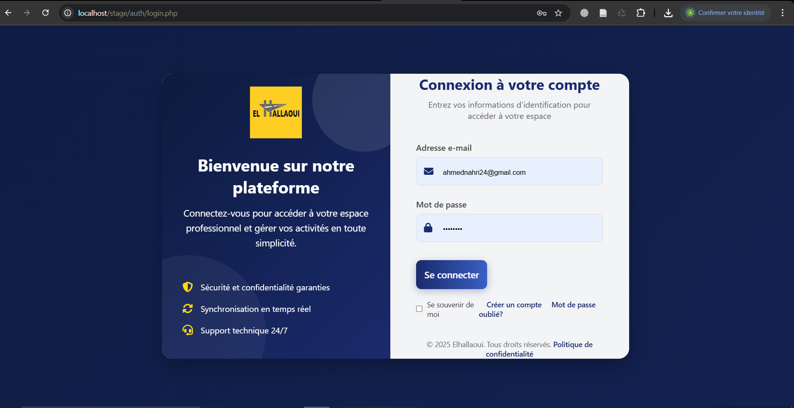 | 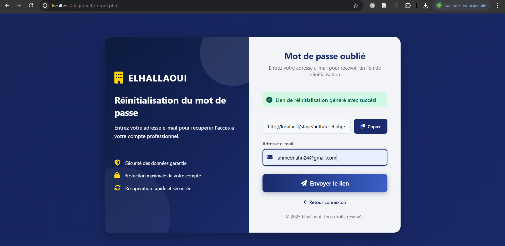 |

| Nouveau mot de passe |
|---|
| 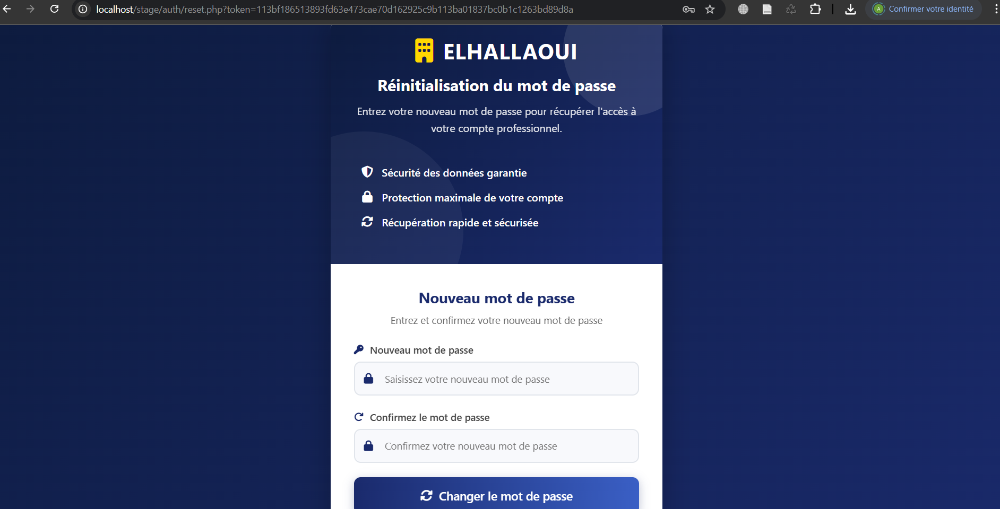 |

### 📊 Tableau de bord & statistiques

| Tableau de bord | Statistiques dynamiques |
|---|---|
| 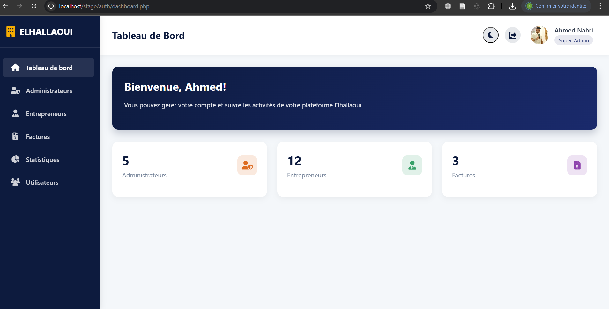 | 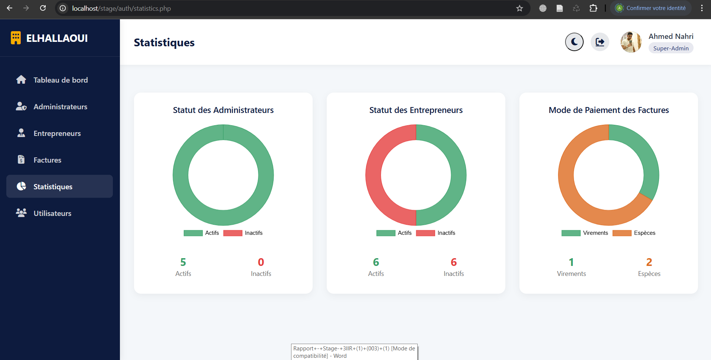 |

### 👥 Gestion des entrepreneurs

| Liste des entrepreneurs | Ajout d'un entrepreneur |
|---|---|
| 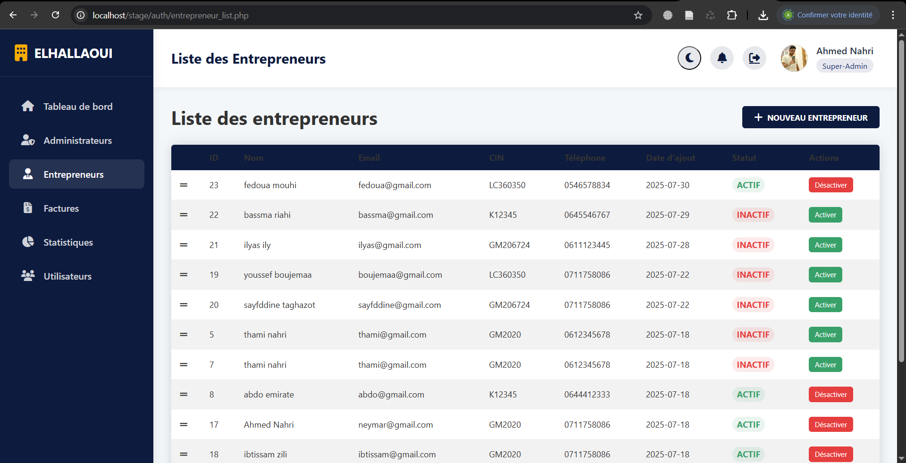 | 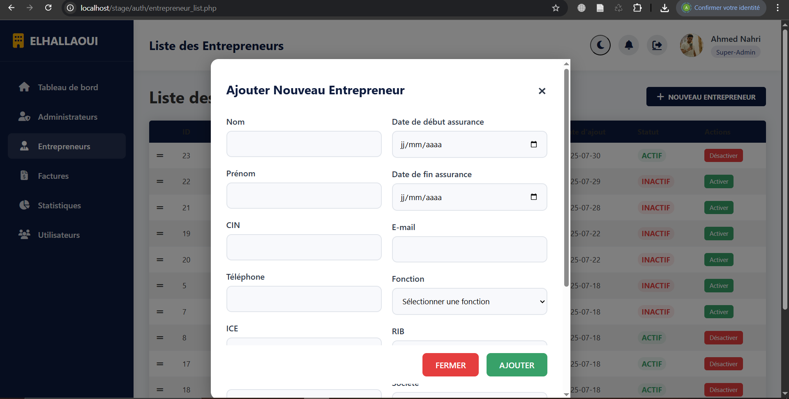 |

### 🛡️ Gestion des administrateurs

| Liste des administrateurs | Ajout d'un administrateur |
|---|---|
| 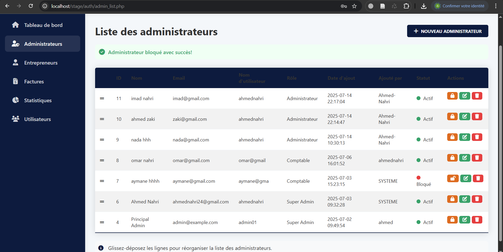 | 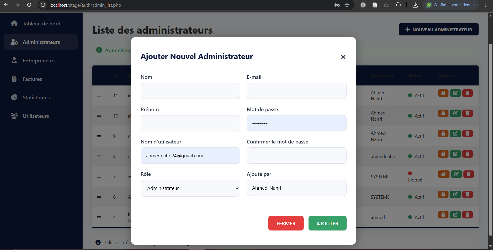 |

### 🧾 Gestion des factures

| Liste des factures | Ajout d'une facture |
|---|---|
| 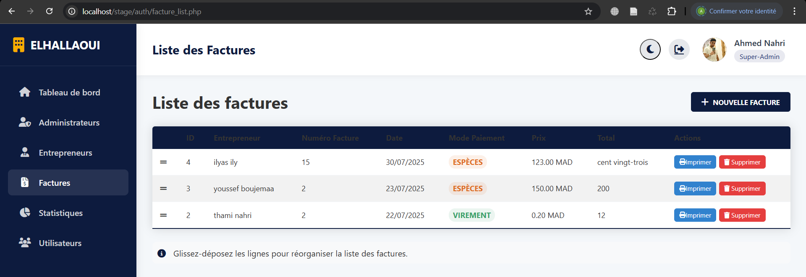 | 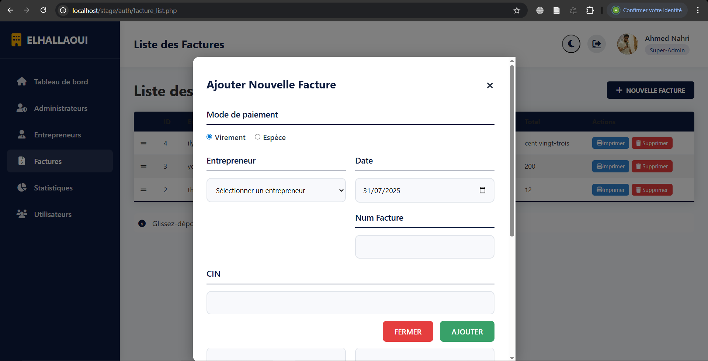 |

| Impression d'une facture |
|---|
| 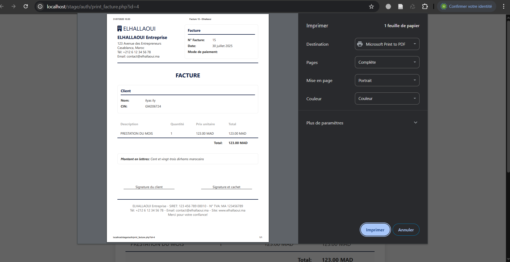 |

## 👨‍💻 Contexte du projet

Projet développé lors d'un **stage de développeur full-stack** chez **El Hallaoui**, du **1er au 31 juillet 2025** (1 mois), durant ma 3ème année d'ingénierie — Computer Engineering & Networks, spécialisation AI & Data Science, à l'EMSI.

## ⚠️ Note

Ce projet a été réalisé dans un cadre professionnel. Les données affichées dans les captures d'écran et exemples ont été anonymisées ou sont fictives — aucune donnée réelle de client n'est incluse dans ce dépôt.